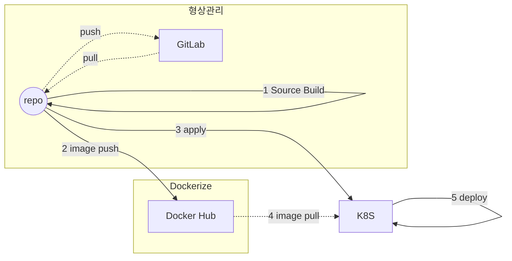

# 워킹 스튜디오

## 워킹 스튜디오(Walking Studio)
본 프로젝트는 개별적인 기업들의 ESG 경영을 위한 탄소중립 컨텐츠를 통합한 전국단위 플랫폼을 목적으로 기획했습니다.

핵심가치
- 낮은 진입장벽을 통한 유저 확보
	- 출석체크형 컨텐츠와는 달리, 자동 수집 데이터를 기반으로 사용자의 접근성을 높인다.
- 현실적 탄소중립 반영
	- 실시간 날씨, 교통량 등 환경 요인을 고려하여 차등화된 점수를 부여하고, 현실적인 탄소 감축 활동을 제안한다.
- 컨텐츠 및 보상의 다양성 확보
	- 개인형 보상이 아닌, 팀/기업/지역/전국 단위의 보상 체계를 도입하여 소속감을 부여하고 및 협업을 장려한다.

## 서비스 시나리오

### 기능적 요구사항
1. 수집
- 모바일 앱에서 걸음 데이터를 주기적으로 수집합니다.
- 공공 데이터 포탈로부터, 1시간 단위의 날씨 정보를 주기적으로 수집합니다.

2. 업데이트
- 날씨 정보가 업데이트 됨에 따라 날씨에 따른 부스트 점수를 계산합니다.
- 모바일 앱에서 수집한 걸음 데이터와 날씨에 따른 부스트 점수를 계산하여, 사용자에게 포인트를 부여합니다.
- 사용자가 챌린지를 달성하였을 때, 보상에 대한 포인트를 부여합니다.

3. 조회
- 사용자가 개인/팀/기업별 걸음 통계 정보를 조회합니다.
- 사용자가 개인/팀/기업별 챌린지 정보를 조회합니다.
- 사용자가 현재 날씨 정보를 조회합니다.

### 비기능적 요구사항
1. 트랜잭션
- 챌린지 보상에 대한 포인트를 요청 받았을 때, 개인/팀/기업의 walking stat 서버와 Req/Resp(Query for Aggregate)로 현재 실제 걸음 수를 확인됐을 때만 보상을 제공합니다.

2. 장애격리
- 개인/팀/기업별 걸음 통계 정보 중 특정 정보가 조회되지 않더라도 나머지 정보에 대해서는 조회가 가능해야 합니다.
- 수집서버와 ETL성 통계 적재 서버는 분리되어야 합니다.
- 수집서버에 대해서는 접속량에 비례하여 자원이 유동적으로 할당되어야 합니다.

3. 성능
- 총 유저 수를 10,000명으로 가정하고, 시스템은 최소 초당 10,000개의 요청을 처리할 수 있어야 합니다.
- 클라이언트 동시접속자를 1,000명으로 가정하고, 조회 서버가 지연없이 요청을 처리할 수 있어야 합니다.

## 체크포인트

#### 분석 설계

- 이벤트스토밍:
    - 스티커 색상별 객체의 의미를 제대로 이해하여 헥사고날 아키텍처와의 연계 설계에 적절히 반영하고 있는가?
    - 각 도메인 이벤트가 의미있는 수준으로 정의되었는가?
    - 어그리게잇: Command와 Event 들을 ACID 트랜잭션 단위의 Aggregate 로 제대로 묶었는가?
    - 기능적 요구사항과 비기능적 요구사항을 누락 없이 반영하였는가?
- 서브 도메인, 바운디드 컨텍스트 분리
    - 팀별 KPI 와 관심사, 상이한 배포주기 등에 따른  Sub-domain 이나 Bounded Context 를 적절히 분리하였고 그 분리 기준의 합리성이 충분히 설명되는가?
        - 적어도 3개 이상 서비스 분리
    - 폴리글랏 설계: 각 마이크로 서비스들의 구현 목표와 기능 특성에 따른 각자의 기술 Stack 과 저장소 구조를 다양하게 채택하여 설계하였는가?
    - 서비스 시나리오 중 ACID 트랜잭션이 크리티컬한 Use 케이스에 대하여 무리하게 서비스가 과다하게 조밀히 분리되지 않았는가?
- 컨텍스트 매핑 / 이벤트 드리븐 아키텍처
    - 업무 중요성과  도메인간 서열을 구분할 수 있는가? (Core, Supporting, General Domain)
    - Request-Response 방식과 이벤트 드리븐 방식을 구분하여 설계할 수 있는가?
    - 장애격리: 서포팅 서비스를 제거 하여도 기존 서비스에 영향이 없도록 설계하였는가?
    - 신규 서비스를 추가 하였을때 기존 서비스의 데이터베이스에 영향이 없도록 설계(열려있는 아키택처)할 수 있는가?
    - 이벤트와 폴리시를 연결하기 위한 Correlation-key 연결을 제대로 설계하였는가?

#### 구현

- [DDD] 분석단계에서의 스티커별 색상과 헥사고날 아키텍처에 따라 구현체가 매핑되게 개발되었는가?
    - Entity Pattern 과 Repository Pattern 을 적용하여 JPA 를 통하여 데이터 접근 어댑터를 개발하였는가
    - [헥사고날 아키텍처] REST Inbound adaptor 이외에 gRPC 등의 Inbound Adaptor 를 추가함에 있어서 도메인 모델의 손상을 주지 않고 새로운 프로토콜에 기존 구현체를 적응시킬 수 있는가?
    - 분석단계에서의 유비쿼터스 랭귀지 (업무현장에서 쓰는 용어) 를 사용하여 소스코드가 서술되었는가?
- Request-Response 방식의 서비스 중심 아키텍처 구현
    - 마이크로 서비스간 Request-Response 호출에 있어 대상 서비스를 어떠한 방식으로 찾아서 호출 하였는가? (Service Discovery, REST, FeignClient)
    - 서킷브레이커를 통하여  장애를 격리시킬 수 있는가?
- 이벤트 드리븐 아키텍처의 구현
    - 카프카를 이용하여 PubSub 으로 하나 이상의 서비스가 연동되었는가?
    - Correlation-key: 각 이벤트 건 (메시지)가 어떠한 폴리시를 처리할때 어떤 건에 연결된 처리건인지를 구별하기 위한 Correlation-key 연결을 제대로 구현 하였는가?
    - Message Consumer 마이크로서비스가 장애상황에서 수신받지 못했던 기존 이벤트들을 다시 수신받아 처리하는가?
    - Scaling-out: Message Consumer 마이크로서비스의 Replica 를 추가했을때 중복없이 이벤트를 수신할 수 있는가
    - CQRS: Materialized View 를 구현하여, 타 마이크로서비스의 데이터 원본에 접근없이(Composite 서비스나 조인SQL 등 없이) 도 내 서비스의 화면 구성과 잦은 조회가 가능한가?
- 폴리글랏 플로그래밍
    - 각 마이크로 서비스들이 하나이상의 각자의 기술 Stack 으로 구성되었는가?
    - 각 마이크로 서비스들이 각자의 저장소 구조를 자율적으로 채택하고 각자의 저장소 유형 (RDB, NoSQL, File System 등)을 선택하여 구현하였는가?
- API 게이트웨이
    - API GW를 통하여 마이크로 서비스들의 집입점을 통일할 수 있는가?
    - 게이트웨이와 인증서버(OAuth), JWT 토큰 인증을 통하여 마이크로서비스들을 보호할 수 있는가?

#### 운영

- SLA 준수
    - 셀프힐링: Liveness Probe 를 통하여 어떠한 서비스의 health 상태가 지속적으로 저하됨에 따라 어떠한 임계치에서 pod 가 재생되는 것을 증명할 수 있는가?
    - 서킷브레이커, 레이트리밋 등을 통한 장애격리와 성능효율을 높힐 수 있는가?
    - 오토스케일러 (HPA) 를 설정하여 확장적 운영이 가능한가?
    - 모니터링, 앨럿팅:

- 무정지 운영 CI/CD
    - Readiness Probe 의 설정과 Rolling update을 통하여 신규 버전이 완전히 서비스를 받을 수 있는 상태일때 신규버전의 서비스로 전환됨을 siege 등으로 증명
    - Contract Test : 자동화된 경계 테스트를 통하여 구현 오류나 API 계약위반를 미리 차단 가능한가?

## 분석/설계
#### AS-IS 조직 (Horizontally-Aligned)


#### TO-BE 조직 (Vertically-Aligned)


### EventStorming 결과
[MSAEz 로 모델링한 이벤트스토밍 결과](https://www.msaez.io/#/53361445/storming/walkingstudio)

#### 이벤트 도출


#### 부적격 이벤트 탈락


- 과정 중 도출된 잘못된 도메인 이벤트들을 걸러내는 작업을 수행합니다.
    - LoginSuccessed : 로그인에 관련된 이벤트는 제외
    - TimePassed : 시간의 흐름(ex. 주기적인 동작)마다 일어나는 경우 Policy 로 대체
    - StatSearched : UI의 이벤트지, 업무적인 이벤트가 아님으로 제외

#### Actor, Command, Policy 부착하여 읽기 좋게


#### Aggregate 으로 묶기


- WalkingHst, WalkingStatByUser/Team/Company, Weather, PointStandardInfo, User, Challenge 은 command, policy, event 들에 의하여 트랜잭션이 유지되어야 하는 단위로 묶었습니다.

#### Bounded Context 로 묶기


- 각기 다른 서버로 관리되어야 한다고 생각되는 주체끼리 bounded context 로 묶었습니다.

#### 컨택스트 매핑 후 완성본(점선은 Pub/Sub, 실선은 Req/Resp)


- get reward 커맨드가 요청됐을 때, Req/Resp 로 Query for Aggregate 인 check walking count 로직을 수행합니다.
    - 도전 과제를 달성하고 포인트(보상)를 요청했을 떄, 악의적인 요청을 방지하기 위해 서버에 저장된 걸음 수와 일치하는지 동기적으로 확인합니다.
    - 사용자에게 보여지는 포인트가 증가됐다가 감소했다가 하는 경우가 생기면 안된다고 판단해서, 비동기로 처리해서 일단 포인트를 증가시키고 문제 발생 시 보상 트랜잭션으로 구현하지 않았습니다.
- 그 외 이벤트는 Pub/Sub 을 이용한 비동기 처리를 통해 결합도를 감소시켰습니다.

## 구현

#### DDD 의 적용

- 각 서비스 내에 도출된 핵심 Aggregate Root 객체를 Entity 로 선언하였습니다.

```Java
package walkingstudio.domain;

import java.time.LocalDate;
import java.util.Date;
import java.util.List;
import javax.persistence.*;
import lombok.Data;
import walkingstudio.CalculatepointApplication;
import walkingstudio.domain.PointCalculated;
import walkingstudio.domain.WeatherInfoUpdated;

@Entity
@Table(name = "PointStandardInfo_table")
@Data
//<<< DDD / Aggregate Root
public class PointStandardInfo {

    @Id
    @GeneratedValue(strategy = GenerationType.AUTO)
    private Long id;

    private Date baseDate;

    private String baseTime;

    private Integer nx;

    private Integer ny;

    private Boolean t1h = false;

    private Boolean wsd = false;

    private Boolean reh = false;

    private Boolean rn1 = false;

    private Double weight;

    @PostPersist
    public void onPostPersist() {
    }

    public static PointStandardInfoRepository repository() {
        PointStandardInfoRepository pointStandardInfoRepository = CalculatepointApplication.applicationContext.getBean(
            PointStandardInfoRepository.class
        );
        return pointStandardInfoRepository;
    }

    //<<< Clean Arch / Port Method
    public static void updateWeatherInfo(
        UsrtFcstHstUpdated usrtFcstHstUpdated
    ) {
        //implement business logic here:
    }

    //>>> Clean Arch / Port Method
    //<<< Clean Arch / Port Method
    public static void calculatePoint(WalkUpdated walkUpdated) {
        //implement business logic here:
    }
    //>>> Clean Arch / Port Method

}
//>>> DDD / Aggregate Root
```

- Entity Pattern 과 Repository Pattern 을 적용하여 JPA 를 통하여 데이터 소스 유형에 대한 별도의 처리가 없도록 했습니다. (현재는 테스트용으로 H2, PostgreSQL 사용)

```Java
package walkingstudio.domain;

import org.springframework.data.repository.PagingAndSortingRepository;
import org.springframework.data.rest.core.annotation.RepositoryRestResource;
import walkingstudio.domain.*;
import java.util.Date;
import java.util.Optional;

//<<< PoEAA / Repository
@RepositoryRestResource(
    collectionResourceRel = "pointStandardInfos",
    path = "pointStandardInfos"
)
public interface PointStandardInfoRepository
    extends PagingAndSortingRepository<PointStandardInfo, Date> {
        Optional<PointStandardInfo> findByNxAndNy(Integer nx, Integer ny);
    }
```

#### Req/Resp 방식의 동기식 아키텍처

분석 단계에서의 조건 중 하나로 "도전 과제 보상 요청(challenge)" -> "걸음 수 확인(walking)" 간의 호출은 동기식 일관성을 유지하는 트랜잭션으로 처리했습니다.
비동기로 처리할 경우 사용자에게 포인트가 먼저 제공되고 문제가 발생했을 때 회수하는 과정을 거칠 경우, 사용자가 불쾌감을 느낄 수 있다고 판단했기 때문입니다.

#### Event Drive 방식의 비동기식 아키텍처

"걸음 수 수집" -> "걸음 수 저장/통계" 로직의 경우,
내부 로직이 블로킹 되지 않도록 Pub/Sub 방식을 활용한 비동기식 호출 처리했습니다.

- 걸음 수가 수집이 되면, 곧바로 수집 됐다는 도메인 이벤트를 카프카로 전송합니다.(Publish)

```Java
package walkingstudio.domain;

@Entity
@Table(name = "walking_hst", schema = "walk")
@IdClass(WalkingHstId.class)
@Getter
@Setter
@Slf4j
//<<< DDD / Aggregate Root
public class WalkingHst {
  ...

    // 생성과 업데이트에서 공통으로 호출되는 이벤트 발행 메서드
    private void publishWalkEvent() {
        // 이벤트가 이미 발행된 경우, 중복 발행을 방지
        if (!eventPublished) {
            WalkUpdated walkUpdated = new WalkUpdated(this);
            walkUpdated.publishAfterCommit();
            eventPublished = true; // 이벤트가 발행된 후 플래그를 설정
        }
    }
}
```

- 걸음 수 저장/통계 서버에서는 수집 이벤트를 수신하여 자신의 정책(로직)을 처리하도록 PolcyHandler 를 구현했습니다.

```Java
package walkingstudio.infra;

//<<< Clean Arch / Inbound Adaptor
@Service
@Transactional
public class PolicyHandler {

  ...

    @StreamListener(
        value = KafkaProcessor.INPUT,
        condition = "headers['type']=='WalkUpdated'"
    )
    public void wheneverWalkUpdated_UpdateWalk(
        @Payload WalkUpdated walkUpdated
    ) {
        // pUserId와 baseDate가 일치하는 레코드 조회
        String pUserId = walkUpdated.getPUserId();
        // baseDate는 월 기준으로 고정 (해당 월의 첫 날로 설정)
        LocalDate firstDayOfMonth = LocalDate.parse(walkUpdated.getBaseDate(), DateTimeFormatter.ofPattern("yyyyMMdd"))
            .withDayOfMonth(1);
        Date baseDate = java.sql.Date.valueOf(firstDayOfMonth);

        Optional<WalkingStatByUser> existingStat = walkingStatByUserRepository.findBypUserIdAndBaseDate(pUserId, baseDate);

        if (existingStat.isPresent()) {
            // 기존 데이터가 있을 경우 walking 값 업데이트
            ...
        } else {
            // 기존 데이터가 없을 경우 새로운 데이터 생성
            ...
        }
    }
}
```

걸음 수 저장/통계 사이트가 유지보수 또는 장애발생으로 잠시 내려간 상태여도 사용자의 걸음 수 데이터를 수집하는 데에는 문제가 없게 됩니다.

#### Scheduler

날씨 데이터의 경우 주기적으로 공공 데이터 포털에 요청을 해야했습니다. 별도의 서버를 두고 Scheduler 를 활용하여 주기적으로 요청을 보내고 응답을 받아 저장하고, 날씨 데이터가 업데이트 됐다는 이벤트를 Kafka 에 전달하여 다음 정책이 수행되도록 구현했습니다.

```Java
package walkingstudio.infra;

@Service
@Transactional
public class PolicyHandler {

  ...

    @Scheduled(fixedDelay = 360000)
    public void requestWeatherInfo() {

      ...

        for (WeatherStnInfo w : weatherStnInfos) {
            WeatherRequest weatherRequest = new WeatherRequest();

            weatherRequest.setBaseDate(baseDate);
            weatherRequest.setBaseTime(baseTime);
            weatherRequest.setNx(w.getNx());
            weatherRequest.setNy(w.getNy());

            // 공공데이터 포털 날씨 정보 API 호출
            String url = String.format("http://apis.data.go.kr/1360000/VilageFcstInfoService_2.0/getUltraSrtNcst?serviceKey=%s&dataType=%s&numOfRows=%d&base_date=%s&base_time=%s&nx=%d&ny=%d",
                weatherRequest.getServiceKey(),
                weatherRequest.getDataType(),
                weatherRequest.getNumOfRows(),
                weatherRequest.getBaseDate(),
                weatherRequest.getBaseTime(),
                weatherRequest.getNx(),
                weatherRequest.getNy()
            );

            try {
                // HttpClient를 사용하여 API 요청
                HttpRequest request = HttpRequest.newBuilder()
                    .uri(URI.create(url))
                    .GET()
                    .build();

                // 4. 요청 보내고 응답 받기
                HttpResponse<String> response = client.send(request, HttpResponse.BodyHandlers.ofString());

                // 응답을 로그로 출력
                // log.info("Response received from API: {}", response.body());

                // 5. JSON 응답 파싱
                List<WeatherResponse> weatherResponses = parseWeatherResponse(response.body());

                ...

                } else {}
            } catch (Exception e) {}
    }
}
```

#### API Gateway

Gateway 설정 파일

```yaml
server:
  port: 8088
---
spring:
  profiles: docker
  cloud:
    gateway:
      routes:
        - id: walkinghistory
          uri: http://walkinghistory:8080
          predicates:
            - Path=/walkingHsts/**,
        - id: weather
          uri: http://weather:8080
          predicates:
            - Path=/usrtFcstHsts/**, /weatherStnInfos/**,
        - id: user
          uri: http://user:8080
          predicates:
            - Path=/users/**,
        - id: userwalkingstat
          uri: http://userwalkingstat:8080
          predicates:
            - Path=/walkingStatByUsers/**, /userPersonalStat/**,
        - id: teamwalkingstat
          uri: http://teamwalkingstat:8080
          predicates:
            - Path=/walkingStatByTeams/**,
        - id: companywalkingstat
          uri: http://companywalkingstat:8080
          predicates:
            - Path=/walkingStatByCompanies/**,
        - id: challenge
          uri: http://challenge:8080
          predicates:
            - Path=/challengeInfos/**, /challengeHsts/**,
        - id: calculatepoint
          uri: http://calculatepoint:8080
          predicates:
            - Path=/pointStandardInfos/**,
        - id: frontend
          uri: http://frontend:8080
          predicates:
            - Path=/**
      globalcors:
        corsConfigurations:
          "[/**]":
            allowedOrigins:
              - "*"
            allowedMethods:
              - "*"
            allowedHeaders:
              - "*"
            allowCredentials: true

server:
  port: 8080
```

## 운영

### CI/CD 설정

- 전체 구성도



- 형상관리

  - GitLab

    전체 모듈의 소스 형상 관리는 GitLab에서 관리된다.

    ```shell
    git clone https://github.com/Min-h-96/walkingstudio
    ```

  - repo

    1. Source Build

       - 각 Framework별 빌드 환경을 설정한다.

         - Spring Boot / jdk15

           ```shell
           export JAVA_HOME=$(/usr/libexec/java_home -v 15)
           ```

         - Node.js 17.x

           ```shell
           export PATH=/path/to/nodejs17/bin:$PATH
           ```

       - 빌드 진행

         - Spring Boot / jdk15

           ```shell
           mvn clean package
           ```

         - Node.js 17.x

           ```shell
           npm run build
           ```

- Dockerize

  - repo

    2. Image push

       - Docker Hub 접속을 위한 환경을 세팅한다.

         ```shell
         docker login
         ```

       - Docker Image 생성

         *Azure 배포환경에 맞게, linux/amd64로 이미지를 설정한다.

         ```
         docker build --platform linux/amd64 -t {{username}}/{{app_name}}:{{YYMMdd##}} . 
         ```

       - Docker Image Push

         ```
         docker push {{username}}/{{app_name}}:{{YYMMdd##}}
         ```

- Deploy

  - repo

    3. deployment apply

       - 접속한 리소스 그룹 및 서비스에 대해 설정한다.

         ```shell
         ##login
         az login
         ##리소스 그룹 및 서비스 설정
         az aks get-credentials --resource-group {{resource_group_name}} --name {{K8S_service_name}}
         ```

       - 배포할 모듈에 대하여, K8S deployment 생성

         ```
         cd {{app_name}}
         kubectl apply -f kubernetes/deployment.yaml
         ```

  - K8S

    4. image pull

       - K8S Container 및 Pod 생성 후. 해당 image를 받아 적용한다.

         - spring-boot-starter-actuator Plugin이 적용된 모듈의 deployment의 경우, actuator 관련 설정을 제외한다.

           ```
           <dependency>
           	<groupId>org.springframework.boot</groupId>
           	<artifactId>spring-boot-starter-actuator</artifactId>
           </dependency>
           ```

    5. deploy

       - 배포 완료 시, 파드 모니터링

         ```
         kubectl get pods
         kubectl logs -f {{pod_name}}
         ```


### 부하 방지 설정

- walkinghistory

  모바일 클라이언트의 데이터 요청에 의해 수집을 담당하고 있는 모듈

  - 많은 접속자 발생 시, 전체 서비스의 부하를 담당하고 있는 수집 모듈은 다중화 서버로 운영한다.

```
apiVersion: apps/v1
kind: Deployment
metadata:
  name: walkinghistory
  labels:
    app: walkinghistory
spec:
  replicas: 3
  selector:
    matchLabels:
      app: walkinghistory
```


- userwalkingstat

  데이터 요청마다 실시간성 통계를 제공하기 위해 ETL을 담당하고 있는 적재 모듈

  - 많은 접속사 발생 시, RDB와 직접적으로 DDL작업을 수행하기 때문에 부하에 따른 스케일 조정이 필요

    - 자원 할당 설정

      ```
      apiVersion: apps/v1
      kind: Deployment
      metadata:
        name: userwalkingstat
        labels:
          app: userwalkingstat
          
      ### ...
                resources:
                  requests:
                    cpu: "500m"
                    memory: "512Mi"
                  limits:
                    cpu: "1"
                    memory: "1Gi"
      
      ```

    - HPA 설정

      ```
      apiVersion: autoscaling/v1
      kind: HorizontalPodAutoscaler
      metadata:
        name: userwalkingstat
      spec:
        scaleTargetRef:
          apiVersion: apps/v1
          kind: Deployment
          name: userwalkingstat
        minReplicas: 1
        maxReplicas: 10
        targetCPUUtilizationPercentage: 50
      ```

      


